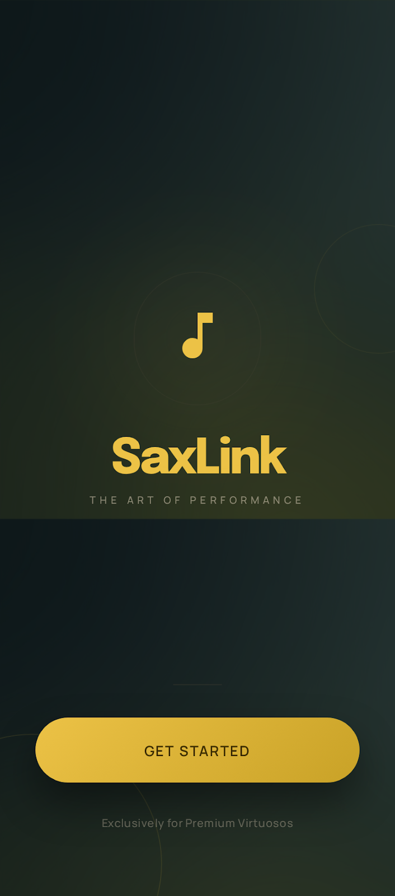
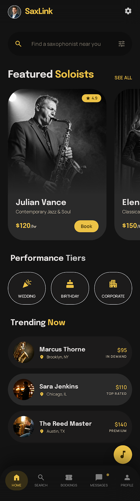
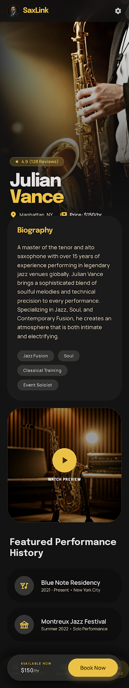
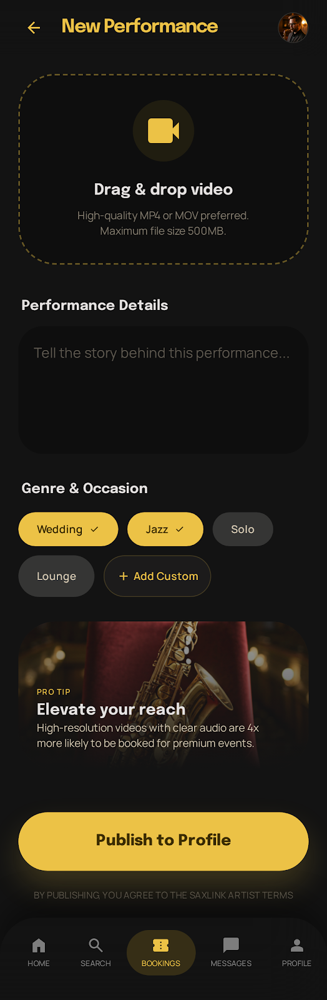
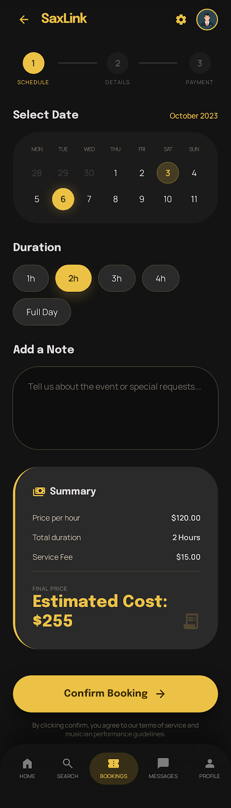
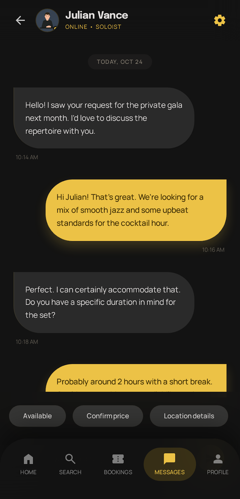
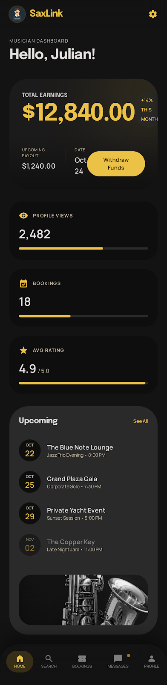

# Sax Performance Booking Platform

**Product Documentation & MVP Specification**

*Product Planning & Development Team*

---

## Abstract

This document outlines the complete product specification for a marketplace platform connecting event organizers with professional saxophone performers. It details the MVP feature set, user experience flows, technology architecture, and go-to-market strategy. The platform aims to formalize and scale the currently fragmented live sax booking ecosystem.

**Related:** The canonical LaTeX source for print/PDF is [`doc.tex`](doc.tex). Build with **pdfLaTeX** in TeXworks (not plain pdfTeX).

**Live web properties**

- [SaxConnect — Book Live Saxophone Performers](https://saxconnect.netlify.app/)
- [SaxLink — Book Live Saxophonists for Any Event](https://saxlink.netlify.app/)

---

## Table of contents

1. [Executive Summary](#1-executive-summary)
2. [Product Overview](#2-product-overview)
3. [Target Users & Market Segments](#3-target-users--market-segments)
4. [MVP Features (Version 1.0)](#4-mvp-features-version-10)
5. [User Experience Flows](#5-user-experience-flows)
6. [Technology Architecture](#6-technology-architecture)
7. [Go-To-Market Strategy](#7-go-to-market-strategy)
8. [Suggested Improvements](#8-suggested-improvements)
9. [Success Metrics & KPIs](#9-success-metrics--kpis)

---

## 1. Executive Summary

The Sax Performance Booking Platform is a two-sided marketplace designed to eliminate friction in booking live saxophone performers for events. By providing structure, visibility, and trust mechanisms, the platform transforms informal word-of-mouth referrals into a scalable, reliable talent marketplace.

### Core value proposition

- **For Event Organizers:** Discover vetted performers, compare options, and book with confidence.
- **For Saxophonists:** Access consistent gig opportunities with transparent pricing and professional visibility.

---

## 2. Product Overview

### Core concept

The platform operates as a focused two-sided marketplace:

- **Supply Side:** Saxophonists (professional, semi-professional, and emerging talent)
- **Demand Side:** Event organizers (weddings, corporate events, celebrations, religious ceremonies)

*Market positioning: “The reliable, professional alternative to informal sax booking.”*

**Early user journey: launch, role selection, and organizer home**

| Splash | Role selection | Organizer home |
| --- | --- | --- |
|  |  |  |

### Problem statement

#### Current state friction

The existing booking ecosystem operates entirely through informal channels:

- Word-of-mouth referrals with limited reach
- WhatsApp groups and private contact networks
- No standardized pricing or service definitions
- Last-minute cancellations and availability uncertainty
- No quality assurance or performance verification
- Difficulty for new performers to build visibility

#### Solution architecture

The platform addresses these gaps through four pillars:

- **Standardization:** Unified profiles, pricing models, and booking workflows
- **Discoverability:** Searchable performer database with advanced filtering
- **Trust Layer:** Ratings, reviews, verification badges, and performance portfolios
- **Operational Efficiency:** In-app messaging, automated scheduling, and payment processing

---

## 3. Target Users & Market Segments

### Event Organizers (Demand Side)

#### Primary segments

- **Wedding Planners:** High-budget events requiring premium talent
- **Corporate Event Hosts:** Team celebrations, client entertainment, brand activations
- **Religious Institutions:** Church services, ceremonies, celebrations
- **Private Party Organizers:** Birthdays, anniversaries, milestone celebrations
- **Venue Managers:** Hotels, restaurants, event spaces seeking entertainment partnerships

#### User characteristics

- Budget-conscious but quality-focused
- Limited network or time to source performers
- Require reliability and professional presentation
- Prefer transparent pricing and clear service terms

### Saxophonists (Supply Side)

#### Primary segments

- **Professional Performers:** Full-time musicians with established reputations
- **Semi-Professional Musicians:** Part-time performers with strong technical skills
- **Emerging Talent:** Developing musicians seeking consistent booking opportunities
- **Session Musicians:** Freelancers available for short-term engagements

#### User characteristics

- Seek consistent, visible access to paid opportunities
- Want professional platform presence to build reputation
- Prefer transparent communication and fair compensation
- Value tools for portfolio building and audience growth

---

## 4. MVP Features (Version 1.0)

### Saxophonist profile system

#### Profile components

Each performer profile must include:

- **Media Assets**
  - High-quality profile photograph
  - 2–5 performance videos (critical for conversion)
  - Optional: audio clips or performance reels
- **Professional Information**
  - Bio (150–300 words)
  - Musical specialties (jazz, classical, contemporary, etc.)
  - Years of experience and notable achievements
- **Operational Details**
  - Primary location and service radius
  - Hourly rate or package pricing
  - Available dates and times
  - Equipment provided vs. required
- **Social Proof**
  - Cumulative rating (5-star scale)
  - Review count and recent reviews
  - Verification badge and number of completed bookings

> **Critical success factor:** Profiles without performance video see 60–70% lower conversion rates. Video content is non-negotiable for MVP.

**Performer profile and performance-focused screen for trust-building**

| Profile | Performance screen |
| --- | --- |
|  |  |

#### Profile creation flow

1. Account registration (email/phone)
2. Basic information (name, location, experience level)
3. Profile photo upload
4. Bio and specialties
5. Pricing configuration
6. Performance video upload (minimum 1 required)
7. Availability calendar setup
8. Profile review and publication

### Booking system

#### Booking flow architecture

The booking system supports two interaction modes:

- **Request-Based Booking:** Organizer submits booking request; performer accepts or declines.
- **Instant Booking:** Organizer books immediately if performer has enabled this option.

#### Booking parameters

Organizers specify the following when making a booking:

- **Event Details**
  - Event type (wedding, birthday, corporate, religious, other)
  - Event date, time, and location
  - Expected guest count
- **Performance Scope**
  - Duration (1 hour, 2 hours, 3+ hours, full event)
  - Performance style preferences
  - Specific song requests (optional)
  - Technical requirements (sound system, staging, etc.)
- **Budget & Terms**
  - Total budget or hourly rate acceptance
  - Deposit/payment terms
  - Cancellation policy acknowledgment

#### Booking status workflow

1. **Pending:** Organizer submits request, awaiting performer response
2. **Confirmed:** Performer accepts, booking locked
3. **In Progress:** Event date has arrived
4. **Completed:** Event finished, eligible for review
5. **Cancelled:** Either party cancels (with timestamp and reason)

**Booking interface aligned with request and confirmation workflows**

### Discovery & search

#### Search interface

- **Location-Based Search**
  - “Saxophonists near me” (GPS-enabled)
  - Manual city/area selection
  - Service radius filtering (5 km, 10 km, 25 km, etc.)
- **Filter Options**
  - Price range (min/max hourly rate)
  - Rating threshold (4.5+, 4.0+, etc.)
  - Availability (specific dates)
  - Musical style (jazz, classical, contemporary)
  - Experience level (emerging, professional, verified)
- **Sort Options**
  - Distance (nearest first)
  - Rating (highest first)
  - Price (lowest/highest first)
  - Popularity (most booked) / Newest (recently joined)

#### Discovery feed

Browse mode for exploratory discovery:

- Card-based performer display with photo, name, rating, and price
- Tap to view full profile
- Save/favourite performers for later comparison

**Discovery view where organizers browse and compare performers**

### In-app messaging system

#### Messaging features

- **Core Functionality**
  - Text message exchange with full history preservation
  - Read receipts and typing indicators
  - Push and in-app notifications
- **Contextual Features**
  - Messages linked to specific booking for context
  - Quick reply templates for common questions
  - File/media sharing (photos, documents)
  - Booking details accessible from chat window

#### Key use cases

- Clarify event logistics and technical requirements
- Negotiate scope, pricing, or special requests
- Share venue information and event details
- Build rapport and establish expectations before the event
- Post-event follow-up and feedback

**In-app messaging for negotiation, logistics, and confirmation**

### Ratings & reviews system

#### Review mechanics

After event completion:

1. Organizer rates performer on a 5-star scale
2. Optional written review submitted (max 500 characters)
3. Performer can respond publicly to any review
4. Reviews displayed on profile (newest first)
5. Ratings aggregated into overall performer score

#### Review criteria

Organizers evaluate performers across five dimensions:

- Performance quality and musicianship
- Professionalism and punctuality
- Communication and responsiveness
- Value for money
- Overall satisfaction

### Payment system (Phase 2 enhancement)

#### Payment flow — future implementation

- **Deposit System**
  - Organizer pays 30–50% deposit at booking confirmation
  - Deposit held in escrow until event completion
  - Released to performer post-event, or refunded if cancelled
- **Full Payment**
  - Remaining balance due before event date
  - Multiple payment methods: card, mobile money, bank transfer
  - Automated payment reminders and status tracking
- **Commission Handling**
  - Platform commission of 10–20% deducted from performer payout
  - Transparent fee breakdown shown to both parties
  - Automated payout to performer after event completion

> **Note:** MVP launches with manual payment coordination via in-app messaging. Integrated payments are a Phase 2 initiative.

---

## 5. User Experience Flows

### Organizer user journey

#### Discovery & selection

1. Organizer opens app and selects “Book a Performer” role
2. Searches by location, filters by date, budget, and rating
3. Browses performer cards and views full profiles
4. Watches performance videos and reads reviews
5. Saves favourites for comparison

#### Booking & communication

1. Selects performer and taps “Request Booking”
2. Fills in event details, scope, and budget
3. Sends booking request; receives confirmation of submission
4. Communicates with performer via in-app messaging
5. Receives booking confirmation when performer accepts
6. Coordinates logistics (location, equipment, song list) via chat

#### Post-event

1. Receives prompt to submit a review after event date passes
2. Rates performer across five criteria
3. Optionally writes a short review
4. Review published on performer profile

### Saxophonist user journey

#### Onboarding & profile setup

1. Downloads app and selects “Performer” role
2. Completes guided profile setup wizard
3. Uploads profile photo and at least one performance video
4. Sets pricing and availability calendar
5. Profile goes live on the platform

#### Managing bookings

1. Receives push notification for new booking request
2. Reviews event details, date, and offered terms
3. Accepts or declines booking (with optional message)
4. Communicates event logistics via in-app chat
5. Marks booking as completed after event
6. Views new review and optionally responds

**Performer dashboard for requests, activity, and booking management**

---

## 6. Technology Architecture

### Recommended stack

The following technology stack is recommended for the MVP, balancing speed of development, scalability, and cost-effectiveness:

| Layer | Technology | Rationale |
| --- | --- | --- |
| Mobile Frontend | React Native | Single codebase for iOS & Android; large talent pool |
| Web Frontend | React.js | Admin dashboard and public profile pages |
| Backend API | Node.js + Express | Fast iteration; JavaScript full-stack |
| Database | PostgreSQL | Relational data suits bookings, users, and reviews |
| File Storage | AWS S3 / Cloudinary | Video and image hosting with CDN delivery |
| Real-Time Messaging | Socket.io | Low-latency in-app chat |
| Authentication | Firebase Auth / Auth0 | Secure, managed auth with social login |
| Payments (Phase 2) | Stripe / Paystack | Africa-friendly; supports mobile money |
| Hosting | AWS / Railway | Scalable infrastructure, easy deployment |

### Key integrations

- **Google Maps API:** Location search, radius filtering, and venue display
- **Firebase Cloud Messaging:** Push notifications for booking updates and messages
- **Cloudinary:** Optimised video/image processing and delivery
- **Twilio / SendGrid:** SMS and email notification fallbacks
- **Paystack / Stripe:** Payment processing and escrow (Phase 2)

### Security & compliance

- All API communication over HTTPS/TLS
- JWT-based authentication with refresh token rotation
- User data encrypted at rest (AES-256)
- GDPR-aligned data handling and privacy policy
- Media content moderation pipeline (automated + human review)

---

## 7. Go-To-Market Strategy

### Launch phases

#### Phase 1 — Private Beta (Months 1–2)

Invite 20–30 curated saxophonists and 10–15 event organizers to validate core flows, surface friction points, and gather testimonials.

- **Success metric:** 5+ successful bookings completed end-to-end
- **Focus:** Profile quality, booking flow, and messaging UX

#### Phase 2 — Public Launch (Months 3–4)

Open registration with a focus on one city or region. Drive supply-side growth first to ensure organizers find performers upon arrival.

- **Target:** 50 active performer profiles in launch market
- **Channels:** Social media, music school partnerships, event planner networks

#### Phase 3 — Expansion (Month 5+)

Replicate the launch playbook in additional cities/regions. Introduce referral incentives and begin onboarding payment integrations.

- **KPIs:** GMV, booking conversion rate, repeat booking rate

### Acquisition channels

- **Saxophonists:** Direct outreach, music college partnerships, Facebook/Instagram musician groups
- **Event Organizers:** Wedding planner associations, corporate HR networks, venue partnerships
- **Content Marketing:** Blog posts on event planning tips, performer spotlight series
- **Referral Programme:** Performers earn bonus credits for every organizer they refer

### Revenue model

- **Transaction Commission (Primary):** 10–20% of each confirmed booking value
- **Featured Listings:** Performers pay to appear at the top of search results
- **Verified Badge Subscription:** Monthly fee for enhanced trust indicators
- **Premium Analytics (Future):** Performers access booking trends and earnings dashboards

---

## 8. Suggested Improvements

### Product enhancements

- **AI-powered matching:** Surface the highest-match performers based on event type, budget, and organizer preferences — reducing search time.
- **Ensemble bookings:** Extend the platform to support small bands and backing tracks alongside solo sax.
- **Recurring bookings:** Allow venues (restaurants, hotels) to set up weekly standing gigs with a single performer.
- **Pre-event checklist:** Automated reminders sent to both parties covering equipment, logistics, and arrival time.
- **Live streaming integration:** Allow performers to stream a mini-set as a live audition directly on their profile.

### Trust & safety improvements

- **ID verification:** Require government-issued ID verification before a performer can accept paid bookings.
- **Dispute resolution:** Formal mediation workflow for cancellations and unfulfilled bookings.
- **Organizer verification:** Light KYC for organizers placing high-value bookings.
- **Background check badge:** Optional add-on for performers working with religious institutions or children's events.

### UX improvements

- **Onboarding video walkthroughs:** Reduce drop-off during profile setup with contextual guidance.
- **Instant price estimator:** Organizers enter event details and get an estimated price range before browsing.
- **Calendar sync:** Two-way sync with Google Calendar / iCal for performers to manage availability.
- **Offline mode:** Cache search results and messaging history for low-connectivity environments.

---

## 9. Success Metrics & KPIs

### Supply side (Performers)

| Metric | MVP target |
| --- | --- |
| Performer registrations | 50 within 60 days of launch |
| Profiles with video | >80% of active profiles |
| Average profile completion | >75% |
| Performer response rate | >85% within 24 hours |

### Demand side (Organizers)

| Metric | MVP target |
| --- | --- |
| Booking requests (Month 1) | 10+ |
| Booking conversion rate | >40% |
| Review completion rate | >60% |
| Repeat booking rate (Month 3) | >25% |

---

*— End of document —*
